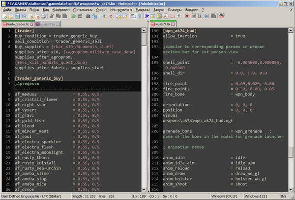

# S.T.A.L.K.E.R.: Shadow of Chernobyl + ApMod

### Что такое ApMod?
**ApMod** — балансный мод, основная цель которого заключается в эффективной настройке механик оригинальной Тени Чернобыля:
1. Полностью перебалансированы характеристики оружия, боеприпасов и брони. Прицельная стрельба в голову или огневая мощь — выбор за вами. Трассирующий состав имеют теперь только снайперские боеприпасы.
2. Полностью перебалансирована точность стрельбы противников. Используйте укрытия, скорость, манёвр и скрытность, иначе вас ждёт лишь бесславная смерть от огня противника. Не рассчитывайте только на броню — хорошую очередь в упор из «Винтореза» не выдержит даже экзоскелет.
3. Перебалансированы характеристики животных и монстров, и местная фауна теперь требует несколько большего уважения.
4. Полностью перебалансированы характеристики расходников, а негативные статусы (кровотечение, облучение, голод) наносят ощутимый урон в секунду, и игнорировать их нельзя. Ешьте, перевязывайте раны, лечитесь и применяйте антирадиационные препараты вовремя.
5. Полностью перебалансированы характеристики артефактов с претензией на возможность полноценного билдостроения. У артефактов изменены визуальные эффекторы, и их лёгкое обнаружение затруднено. Некоторые ценные артефакты не имеют эффекторов вовсе — будьте внимательны.
6. Значительная часть ценных предметов разложена по локациям вручную с большой тщательностью. Исследуйте локации заново: орлиная наблюдательность, неуёмное любопытство и умелый паркур будут вознаграждены.
7. Полностью перебалансированы экономика и лут, а также содержимое тайников. Алчность и трудолюбие не подведут матёрого сталкера.
8. Полностью перебалансированы торговцы, реализована прогрессия доступности товаров. Заглядывайте в магазины после важных событий — там много чего интересного.
9. Добавлена возможность ремонта уникального и редкого оружия у Сидоровича на Кордоне, а также научных защитных костюмов — у Сахарова на Янтаре.
10. Заменены эффекторы приборов ночного видения: теперь доступно три поколения ПНВ, а их работа больше не сопровождается цикличным звуком. ПНВ доступны только на небольшом количестве защитных костюмов, их наличие указано в описании.
11. Текстура налобного фонарика заменена на нейтральную. Сам фонарик стал значительно менее мощным, а в силу ограниченной доступности ПНВ посещение подземелий подарит немало аутентичного сталкерского опыта.
12. В HUD прицел-крестик заменён на точку.
13. В HUD добавлена шкала облучения радиацией (интегрирован мод `UI Radiation Mod 0.3`).
14. Исправлены названия всех видов оружия на настоящие. Исправлено огромное количество грамматических ошибок в оригинальных текстах и диалогах.
15. Отключены все заставочные рекламные видеоролики при запуске игры.

### С чего всё началось и зачем этот мод лично вам?
Мне всегда нравилась первая часть, потому что в ней был атмосфера, идея, душа, если хотите. Как водится в геймдеве, разрабы сами не поняли, что они сделали, и в последующих частях, несмотря более высокий технологический уровень исполнения движка и новые механики, просрали все полимеры.

Но играть в ванильную первую часть в наше время без слёз просто невозможно, поэтому я попытался выжать из неё максимум при разумных трудозатратах.
Делал, прежде всего, для себя, руководствуясь революционным чутьём и большим опытом моддинга разных проектов. Главным принципом был «Не навреди».
Лично вам я рекомендую попробовать этот мод, если вы хотите перепройти игру, но не скрежетать зубами от тьмы ненастроенного ориджинал контента.
Оружие теперь стреляет нормально, все артефакты ситуативно полезны, баланс лута дает уверенность в его ценности, выбор и цены у торговцев вполне адекватны.
Основной упор сделан на то, чтобы играть было комфортно и интересно, а не больно и противно.

> [!WARNING]
> Уровень сложности игры *обязательно* установить на «**Мастер**» — под него всё балансировалось.
>
> Кроме того, *настоятельно* рекомендуется в настройках игры **убрать отображение прицела-крестика** на экране, поскольку все характеристики вооружения настраивались именно под режим ручного прицеливания. Поначалу это может показаться неудобными или непривычным, но именно это режим является максимально соответствующим духу игры.

### Порядок установки
1. Установить оригинальную игру `S.T.A.L.K.E.R.: Shadow Of Chernobyl` версии `1.0006`. Например, в папку `c:\games\stalker\`.
2. Распаковать содержимое архива `stalker_apmod.zip` в папку игры `c:\games\stalker\`, чтобы в ней появилась папка `c:\games\stalker\gamedata\`. Самый простой способ установки для ленивых: сохранить архив в папку игры и выполнить команду «*Распаковать здесь*».
3. Для ценителей разнообразия сталкерских анекдотов у костра имеет специальный архив из всех анекдотов, входящих в трилогию: Тень Чернобыля, Чистое Небо, Зов Припяти. Скачайте и распакуйте в папку игры содержимое архива `gamedata_characters_voice.zip`, чтобы появилась папка `c:\games\stalker\gamedata\sounds\characters_voice`.
4. Если вы любитель обмазывания другими модами, то совместимости с ними ожидать не следует. Я распаковывал архивы игры и вносил изменения в оригинальные файлы. Софт для распаковки [прикладываю](/soft).

P.S. Если не знаете, как сохранять файлы с гитхаба, вэлкам в [одноименный пост](https://github.com/apscrap/notes/tree/main/data/2025/2025-06-11-how-to-download-files).

P.P.S. Фидбэк направляйте в [спортлото](https://github.com/apscrap/notes/blob/main/data/2025/2025-06-06-new-life/mail.md).

> [!NOTE]
> В процессе работы над модом я написал небольшой [конфигурационный файл](soft/userdefinelang_ltx.zip) с подсветкой синтаксиса в файлах `.ltx` для лучшего в мире текстового редактора [Notepad++](https://download.notepad-plus-plus.org/repository/7.x/7.6/npp.7.6.bin.x64.zip) — именно такой тип файлов используется игрой. Это обычные текстовые файлы, но с определённой структурой. Конфиг небезупречный, подходит только к теме оформления `Zenburn`, которую я использую, но всё же вдруг кому-то пригодится. В конце концов, под себя всегда можно допилить.
> 
> В архиве находится файл `userDefineLang.xml`, который нужно закинуть либо в корневую папку Notepad++ (если используется portable-версия), либо в `%APPDATA%\Notepad++` (если используется обычная версия с инсталлятором). Теперь файлы с расширением `.ltx` будут подсвечиваться автоматически при открытии их через Notepad++.
> 
> **ВАЖНО!** При уже имеющемся файле `userDefineLang.xml` ни в коем случае не перезаписывать — потеряете другие пользовательские синтаксисы! Нужно просто открыть этот xml-файл в *текстовом* редакторе и внутрь блока `<NotepadPlus>...</NotepadPlus>` скопировать блок `<UserLang name="LTX (Stalker)" ext="ltx" udlVersion="2.1">...</UserLang>` целиком.
>
> На всякий случай выкладываю полностью настроенную portable-версию редактора: [notepad++.zip](soft/notepad++.zip).
> 
> 
