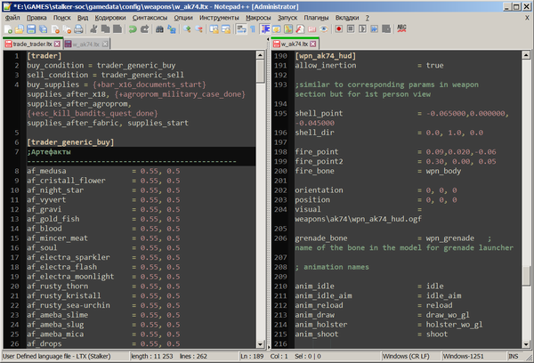

# S.T.A.L.K.E.R.: Shadow of Chernobyl + ApMod

### Что такое ApMod?
**ApMod** — балансный мод, основная цель которого заключается в эффективной настройке механик оригинальной Тени Чернобыля:
1. Полностью перебалансированы характеристики оружия, боеприпасов, брони, а также перенастроена модель повреждений. Названия всех видов оружия исправлены на реальные.
2. Значительно увеличена точность стрельбы противников.
3. Перебалансированы характеристики монстров, и местная фауна теперь требует несколько большего уважения.
4. Полностью перебалансированы характеристики расходников, а негативные статусы (кровотечение, облучение, сильный голод) наносят ощутимый урон в секунду, и игнорировать их нельзя.
5. Полностью перебалансированы характеристики артефактов. Все артефакты размещены по локациям вручную. У ряда артефактов изменены визуальные эффекторы, и их обнаружение затруднено. Некоторые ценные артефакты не имеют эффекторов вовсе — будьте внимательны.
6. Значительная часть ценных предметов разложена по локациям вручную с большой тщательностью. Исследуйте мир заново: орлиная наблюдательность, кошачье любопытство и носорожий паркур будут вознаграждены.
7. Полностью перебалансировано количества лута с противников и содержимое тайников.
8. Полностью перебалансированы экономика и торговцы, реализована прогрессия доступности товаров. Оружие можно продавать в любом состоянии, но цена продажи линейно от него зависит.
9. Добавлена возможность ремонта уникального и дорогого оружия у Сидоровича на Кордоне.
10. Заменены эффекторы приборов ночного видения: теперь доступно три поколения ПНВ, а их работа больше не сопровождается цикличным звуком. ПНВ доступны только на небольшом количестве защитных костюмов (наличие и тип ПНВ указаны в описании костюма).
11. Убран звуковой сигнал детектора аномалий, работает только звуковой сигнал счетчика Гейгера.
12. Текстура налобного фонарика заменена на нейтральную. Сам фонарик стал значительно менее мощным, а в силу ограниченной доступности ПНВ посещение подземелий подарит немало аутентичного сталкерского опыта.
13. В HUD убран счетчик КПК сталкеров и метки врагов на миникарте.
14. В HUD прицел-крестик заменён на точку. Тем не менее, я рекомендую полностью отключить прицел в настройках игры (об этом ниже).
15. В HUD добавлена шкала облучения радиацией (интегрирован мод `UI Radiation Mod 0.3`).
16. Отключены все заставочные рекламные видеоролики при запуске игры.

### С чего всё началось и зачем этот мод лично вам?
Мне всегда нравилась первая часть, потому что в ней был атмосфера, идея, душа, если хотите. Как водится в геймдеве, разрабы сами не поняли, что они сделали, и в последующих частях, несмотря более высокий технологический уровень исполнения движка и новые механики, просрали все полимеры.

Но играть в ванильную первую часть в наше время без слёз просто невозможно, поэтому я попытался выжать из неё максимум при разумных трудозатратах.
Делал, прежде всего, для себя, руководствуясь здравым смыслом и большим опытом моддинга разных проектов. Главным принципом был «Не навреди».
Лично вам я рекомендую попробовать этот мод, если хочется перепройти игру, но не скрежетать зубами от тьмы ненастроенного оригинального контента.

Ключевые особенности мода:
1. Удалось добиться адекватного поведения вооружения и боеприпасов. Наконец-то можно быть уверенным в своем оружии, метко стрелять в голову и эффективно управлять огнем. Под стать оружию полностью переделаны система повреждений и характеристики защитных костюмов.
2. Получилось создать экосистему для применения артефактов и создания билдов. Характеристики артефактов ни имеют ничего общего с оригинальной игрой, и несут себе совершенно другие идеи по синергии артефактов и влиянию на прогрессию персонажа.
3. Новая агрессивная модель негативных статусов не позволит игнорировать облучение и кровотечения, поэтому нужно грамотно пользоваться расходниками и артефактами.
4. Балансировка лута с противников, содержимого тайников и доступности товаров позволила создать работоспособную модель экономики, в которой у вас не будут копиться несметные количества абсолютно бесполезных предметов. Тем не менее, особого дефицита не будет, потому что это не хардкорный мод.
5. Отлючение счетчика КПК врагов и их маркеров на миникарте, отсутствие звука детектора аномалий и снижение мощности фонарика нагнетают саспенс.

> [!WARNING]
> Уровень сложности игры нужно *обязательно* установить на «**Мастер**» — под него всё балансировалось.
>
> Кроме того, *настоятельно* рекомендуется в настройках игры **убрать отображение прицела-крестика** на экране, поскольку все характеристики вооружения настраивались именно под режим ручного прицеливания. Поначалу это может показаться неудобными или непривычным, но именно этот режим является максимально соответствующим духу игры.

### Порядок установки
1. Установить оригинальную игру `S.T.A.L.K.E.R.: Shadow Of Chernobyl` версии `1.0006`. Например, в папку `c:\games\stalker\`.
2. Распаковать содержимое архива `stalker_apmod.zip` в папку игры `c:\games\stalker\`, чтобы в ней появилась папка `c:\games\stalker\gamedata\`. Самый простой способ установки для ленивых: сохранить архив в папку игры и выполнить команду «*Распаковать здесь*».
3. В состав мода включены все анекдоты, входящие в трилогию: ТЧ, ЧН, ЗП. Если вам не нужны дополнительные анекдоты, удалите папку `c:\games\stalker\gamedata\sounds\characters_voice\`. 

P.S. Если не знаете, как сохранять файлы с гитхаба, вэлкам в [одноименный пост](https://github.com/apscrap/notes/tree/main/data/2025/2025-06-11-how-to-download-files).

P.P.S. Фидбэк направляйте в [спортлото](https://github.com/apscrap/notes/blob/main/data/2025/2025-06-06-new-life/mail.md).

> [!NOTE]
> В процессе работы над модом я написал небольшой [конфигурационный файл](soft/userdefinelang_ltx.zip) с подсветкой синтаксиса в файлах `.ltx` для лучшего в мире текстового редактора [Notepad++](https://download.notepad-plus-plus.org/repository/7.x/7.6/npp.7.6.bin.x64.zip) — именно такой тип файлов используется игрой. Это обычные текстовые файлы, но с определённой структурой. Конфиг небезупречный, подходит только к теме оформления `Zenburn`, которую я использую, но всё же вдруг кому-то пригодится. В конце концов, под себя всегда можно допилить.
> 
> В архиве находится файл `userDefineLang.xml`, который нужно закинуть либо в корневую папку Notepad++ (если используется portable-версия), либо в `%APPDATA%\Notepad++` (если используется обычная версия с инсталлятором). Теперь файлы с расширением `.ltx` будут подсвечиваться автоматически при открытии их через Notepad++.
> 
> **ВАЖНО!** При уже имеющемся файле `userDefineLang.xml` ни в коем случае не перезаписывать — потеряете другие пользовательские синтаксисы! Нужно просто открыть этот xml-файл в *текстовом* редакторе и внутрь блока `<NotepadPlus>...</NotepadPlus>` скопировать блок `<UserLang name="LTX (Stalker)" ext="ltx" udlVersion="2.1">...</UserLang>` целиком.
>
> На всякий случай выкладываю полностью настроенную portable-версию редактора: [notepad++.zip](soft/notepad++.zip).
> 
> 
