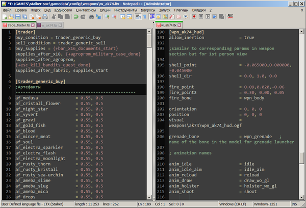

# S.T.A.L.K.E.R.: Тень Чернобыля + ApMod

### Что такое ApMod?
**ApMod** — балансный мод, основная цель которого заключается в эффективной настройке механик оригинальной Тени Чернобыля.

### Ключевые особенности мода
- [x] Адекватное поведение вооружения и боеприпасов. Наконец-то можно быть уверенным в своем оружии, метко стрелять в голову и эффективно управлять огнем. Под стать оружию полностью переделаны система повреждений и характеристики защитных костюмов.
- [x] Экосистема для применения артефактов и создания билдов. Характеристики артефактов ни имеют ничего общего с оригинальной игрой, а также несут себе совершенно другие идеи по синергии артефактов и влиянию на прогрессию персонажа.
- [x] Агрессивная модель негативных статусов. Теперь нельзя игнорировать облучение и кровотечения, поэтому нужно грамотно пользоваться расходниками и артефактами.
- [x] Работоспособная модель экономики. Балансировка лута с противников, содержимого тайников и доступности товаров позволила создать систему, в которой у вас не будут копиться несметные количества абсолютно бесполезных предметов. Тем не менее, особого дефицита не будет, потому что это не хардкорный мод.
- [x] Отлючение счетчика КПК врагов и их маркеров на миникарте, отсутствие звука детектора аномалий и снижение мощности фонарика нагнетают саспенс.

### С чего всё началось и зачем этот мод лично вам?
Мне всегда нравилась первая часть, потому что в ней был атмосфера, идея, душа, если хотите. Как водится в геймдеве, разрабы сами не поняли, что они сделали, и в последующих частях, несмотря более высокий технологический уровень исполнения движка и новые механики, просрали все полимеры.

Но играть в ванильную первую часть в наше время без слёз просто невозможно, поэтому я попытался выжать из неё максимум при разумных трудозатратах.
Делал, прежде всего, для себя, руководствуясь здравым смыслом и большим опытом моддинга разных проектов. Главным принципом был «не навреди».
Рекомендую попробовать этот мод, если хочется перепройти *оригинальную* игру, но не скрежетать зубами от тьмы ненастроенного контента.

### Список изменений
- [x] Перебалансированы характеристики оружия, боеприпасов, брони, а также перенастроена модель повреждений. Названия всех видов оружия исправлены на реальные.
- [x] Значительно увеличена точность стрельбы противников.
- [x] Перебалансированы характеристики монстров, и местная фауна теперь требует несколько большего уважения.
- [x] Перебалансированы характеристики расходников, а негативные статусы (кровотечение, облучение, сильный голод) наносят ощутимый урон в секунду, и игнорировать их нельзя.
- [x] Перебалансированы характеристики артефактов. Все артефакты размещены по локациям вручную. У ряда артефактов изменены визуальные эффекторы, и их обнаружение затруднено. Некоторые ценные артефакты не имеют эффекторов вовсе — будьте внимательны.
- [x] Значительная часть ценных предметов разложена по локациям вручную с большой тщательностью. Исследуйте мир заново: орлиная наблюдательность, кошачье любопытство и носорожий паркур будут вознаграждены.
- [x] Перебалансировано количества лута с противников и содержимое тайников. Части тел монстров появляются с вероятностью 100%.
- [x] Перебалансированы экономика и торговцы, реализована прогрессия доступности товаров. Оружие можно продавать в любом состоянии, но цена продажи линейно от него зависит.
- [x] Добавлена экспериментальная возможность ремонта уникального и дорогого оружия у Сидоровича через диалог. Не забывайте перед ремонтом снять обвес (прицел, глушитель, подствольник), иначе всё пропадёт.
- [x] Заменены визуальные эффекторы приборов ночного видения: теперь доступно три поколения ПНВ, а их работа больше не сопровождается цикличным звуком. ПНВ доступны только на небольшом количестве защитных костюмов (наличие и тип ПНВ указаны в описании костюма).
- [x] Убраны визуальные эффекторы радиоактивных и аномальных зон. Повышенный радиационный фон детектируется по счетчику Гейгера и эффекторам цифрового шума.
- [x] Убран звуковой сигнал детектора аномалий, работает только звуковой сигнал счетчика Гейгера.
- [x] В HUD добавлена шкала степени облучения радиацией (интегрирован мод `UI Radiation Mod 0.3`).
- [x] В HUD убран счетчик КПК сталкеров и метки врагов на миникарте. Убран звук тяжелого дыхания у ботов при беге во время боя.
- [x] В HUD прицел-крестик заменён на точку.
- [x] Текстура налобного фонарика заменена на нейтральную. Сам фонарик стал значительно менее мощным, а в силу ограниченной доступности ПНВ посещение подземелий подарит немало аутентичного сталкерского опыта.
- [x] Исправлены различные баги в квестах и скриптах.
- [x] Отключены все заставочные рекламные видеоролики при запуске игры.

### Порядок установки
1. Установить оригинальную игру `S.T.A.L.K.E.R.: Shadow Of Chernobyl` версии `1.0006`. Например, в папку `c:\games\stalker\`.
2. Если игра уже установлена, в корневой папке игры не должно быть папки `\gamedata\`. Если она есть (у вас установлены другие моды), ее нужно удалить или переименовать. Совместимости данного мода с другими модами нет.
3. Распаковать содержимое архива [stalker_apmod.7z](stalker_apmod.7z) в папку игры `c:\games\stalker\`, чтобы в ней появилась папка `c:\games\stalker\gamedata\`. Самый простой способ установки для ленивых: сохранить архив в папку игры и выполнить команду «*Распаковать здесь*».

P.S. Если не знаете, как сохранять файлы с гитхаба, вэлкам в [одноименный пост](https://github.com/apscrap/notes/tree/main/data/2025/2025-06-11-how-to-download-files).

P.P.S. Фидбэк направляйте в [спортлото](https://github.com/apscrap/notes/blob/main/data/2025/2025-06-06-new-life/mail.md).

### Ключевые рекомендации по прохождению
- [x] Уровень сложности игры нужно **_обязательно_** установить на «*Мастер*» — под него всё балансировалось.
- [x] Громкость музыки обязательно установить на максимум ради великолепных эмбиентов локаций.
- [x] Полное динамическое освещение крайне желательно: игру света и теней словами не передать. Ползунки гаммы, контраста и яркости *в идеале* должны быть посередине. Идиллию портит лишь странноватое небо и сильный засвет определенных текстур фонариком — в статике таких проблем нет.
- [x] Прицел-крестик обязательно отключить (`Опции` -> `Игра` -> `Показывать прицел`). Со временем вы поймёте причину — это очень много дополнительных очков к погружению в атмосферу.
- [x] *Слушать* счётчик Гейгера и следить за шкалой облучения (над шкалой здоровья). Не брезговать водочкой.
- [x] Играть иммерсивно, не сейвскамить. Исследовать аномальные и радиоактивные зоны по-честному: получать урон и тратить расходники, а не абузить `F5`->`F9`. Тем не менее, сейвиться периодически надо просто потому, что это же сталкач — баги и вылеты бывают *внезапно*.
- [x] В любой непонятной ситуации юзать бинт — кровотечения очень опасны.
- [x] Помнить о наличии в игре не только обычного приседания, но и глубокого приседания — без этого много где не пролезть в принципе.
- [x] Паркурить, ползать, искать нычки везде и всюду — их добавлено немало.
- [x] Покупать броники. Халявы *почти* не будет.
- [x] Стрелять в голову. Серьёзно. Результат не разочарует.
- [x] Бронебойные версии боеприпасов считать премиумными — лучшими во всём (это так и есть).
- [x] Пользоваться гранатами. В зданиях и плотной застройке им нет равных.
- [x] Внимательно читать описания артефактов. Пробовать разные комбинации. Экспериментировать, одним словом.
- [x] Подзаработать можно на побочных квестах, продаже артефактов и частей монстров учёным, а также продаже натовских стволов. Квесты не имеют ограничений по времени — спешить некуда.
- [x] Вообще никуда не торопиться. Зона — не место для суеты. Зашторьте окна в комнате, выключите свет, колоночки сделайте погромче. Вслушивайтесь в шорохи, всматривайтесь в темноту. Ощутите величие этого мира. 

### Известные баги и проблемы движка
- [x] Попытка использовать расходник (еда, аптечка и т.д.) непосредственно из контейнера или инвентаря трупа приводит к крашу игры.
- [x] Если противник получил крит и выронил оружие, но не был убит, в его луте не будет боеприпасов к основному оружию. Это не столько баг, сколько особенность реализации генерации лута — выпадаемые боеприпасы зависят от имеющегося у бота оружия на момент смерти.
- [x] Магазин основного оружия у убитого бота *всегда* будет пустым, если только не было специальной анимации (бот картинно умирает, зажимая гашетку).
- [x] Лут из разрушаемых контейнеров (деревянные и стальные ящики) может проваливаться вниз через текстуры. В основном проблема касается многоэтажных построек и крыш, поэтому часто после разрушения контейнеров целесообразно бывает проверить этаж ниже.
- [x] Загрузка сейва приводит всех ботов в состояние агра, даже если на момент сохранения они не знали о присутствии игрока.
- [x] Рекомендуется также как можно меньше пользоваться быстрыми загрузками — лучше обычными, через меню. Кроме того, не стоит сохраняться *в процессе* выполнения некоторых побочных квестов, потому что при загрузке сбрасывается привязанный к квесту глобальный счётчик. Так, например, сбрасывается счётчик живых свободовцев при штурме позиций долговцев, а это влияет на награду.
- [x] Существует так называемый «эффект СВД». Если выстрелить из СВД или СВУ, а затем поменять оружие на какое-то другое, отдача у второго ствола возрастет до уровня СВД. Если сначала пострелять из другого ствола и сменить его на СВД, у СВД снизится отдача до уровня другого ствола. Это баг движка. Лечится только выбрасыванием оружия и поднятием с земли.
- [x] В редких случаях после нахождения в области с критическим уровнем радиации (за границами карты) выход из такой области не сбрасывает эффект нахождения в ней — уровень облучения продолжает бесконечно расти. Сохранения и загрузки, переход между локациями и выход из игры не помогают. Для решения проблемы нужно *вернуться* в такую область, сохраниться, выйти из игры, загрузиться, покинуть область, полностью снять облучение расходниками. Должно помочь.

> [!NOTE]
> В процессе работы над модом я написал небольшой [конфигурационный файл](soft/userdefinelang_ltx.zip) с подсветкой синтаксиса в файлах `.ltx` для лучшего в мире текстового редактора [Notepad++](https://github.com/notepad-plus-plus/notepad-plus-plus/releases/download/v7.6/npp.7.6.bin.x64.7z) — именно такой тип файлов используется игрой. Это обычные текстовые файлы, но с определённой структурой. Конфиг небезупречный, подходит только к теме оформления `Zenburn`, которую я использую, но всё же вдруг кому-то пригодится. В конце концов, под себя всегда можно допилить.
> 
> В архиве находится файл `userDefineLang.xml`, который нужно закинуть либо в корневую папку Notepad++ (если используется portable-версия), либо в `%APPDATA%\Notepad++` (если используется обычная версия с инсталлятором). Теперь файлы с расширением `.ltx` будут подсвечиваться автоматически при открытии их через Notepad++.
> 
> **ВАЖНО!** При уже имеющемся файле `userDefineLang.xml` ни в коем случае не перезаписывать — потеряете другие пользовательские синтаксисы! Нужно просто открыть этот xml-файл в *текстовом* редакторе и внутрь блока `<NotepadPlus>...</NotepadPlus>` скопировать блок `<UserLang name="LTX (Stalker)" ext="ltx" udlVersion="2.1">...</UserLang>` целиком.
>
> На всякий случай выкладываю полностью настроенную portable-версию редактора: [notepad++.zip](soft/notepad++.zip).
> 
> 
